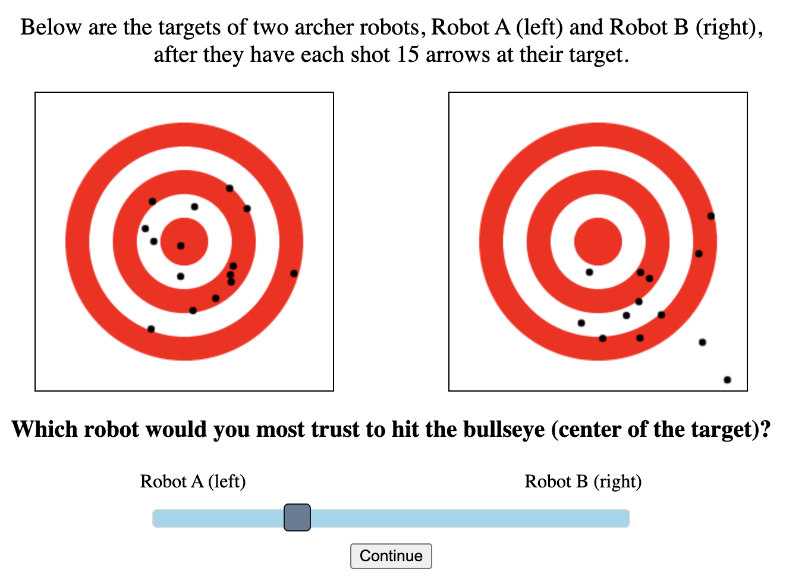

# About

This is the code repository for the Grand Challenge by Teresa Gao and Brandon Koo for MIT 6.834 Cognitive Robotics.

## Quickstart

To run the experiment, open up experiment.html in your browser. Feel free to toggle the experimental parameters in js/experiment.js; each section in the code is labeled with a comment block.

The experiment has also been deployed live at https://www.mit.edu/~t_gao/projects/6.834/experiment.html.

At the end of the experiment, the raw data will be output in a gray block. This data will need to be manually saved.

# Design

## Overview

We designed, implemented, and piloted a study to better determine objective factors which might influence humans' trust of robotic agents. We provide participants with the scenario that they are evaluating the performance of archer robots. We present participants with pairs of targets, each showing shots by one of two archer robots, and ask them to indicate on a sliding scale between the two options which archer robot they would trust more.

We determined that robot archery (target shooting) is an appropriate task to evaluate human trust because of several reasons. Given that no robot archer presented to the participants is be perfect (i.e., no robot would land all of its shots accurately and precisely in the bullseye of its target), the task requires the non-objective evaluation of the trustworthiness of one robot archer over another. And as the raw response data --- the strengths of participants' relative preferences for one robot archer over another as well as the coordinates of each robot archer's shot on its target --- is unambiguous, our experimental setup allows us to translate the subjectivity of human-robot trust into objective data that we can process to find patterns.

## Experimental Setup

We presented each human participant with 15 pairs of two five-ringed targets, each with 15 shots per target. The radius of each target was 100 pixels. We simulated the Gaussian random generation by using a Box-Muller function to generate x-y coordinates for each shot relative to the center of each robot archer's shot grouping. We used the same Box-Muller function to determine the offset of the center of each robot archer's shot grouping from the bullseye (origin). We provided participants with a sliding scale between the two robot archers (Robot A on the left and Robot B on the right, arbitrarily designated) to indicate their relative perceived trustworthiness of each. In addition to optional demographic data at the end of the experiment, we logged the sliding scale output (-1 for complete trust of Robot A on the left and 1 for complete trust of Robot B on the right), the coordinates of the 15 shots per robot relative to the origin of the target, and the duration in sections of how long participants spent evaluating each pair of targets.
